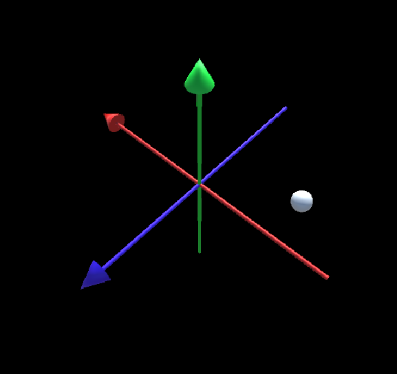
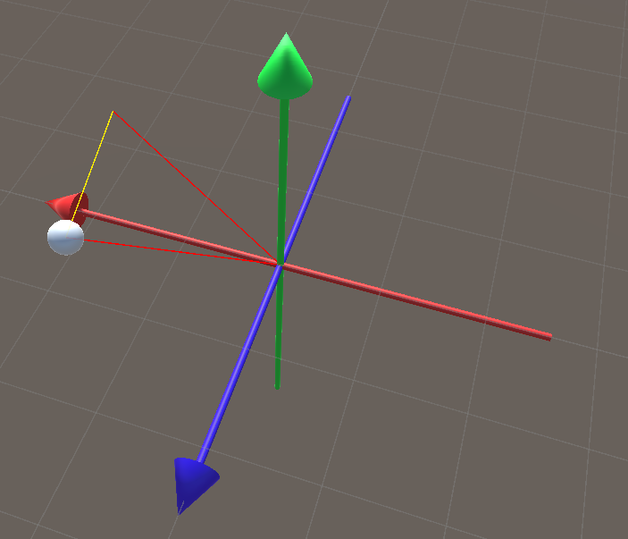
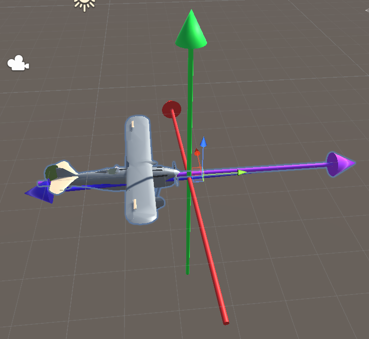
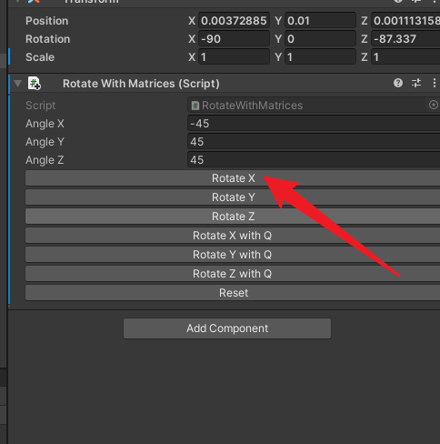

---

---

# QuaternionNotes

[TOC]

### 1. 绕轴旋转演示 [演示Package](Packages/RotationStarter.unitypackage)



```csharp
public class Rot : MonoBehaviour
{
    float angle = 45;
    // Start is called before the first frame update
    void Start()
    {
        Vector3 initialPos = this.transform.position;
        float posx = initialPos.x * Mathf.Cos(angle * Mathf.Deg2Rad) + initialPos.z * Mathf.Sin(angle * Mathf.Deg2Rad);
        float posz = initialPos.x * -Mathf.Sin(angle * Mathf.Deg2Rad) + initialPos.z * Mathf.Cos(angle * Mathf.Deg2Rad);
        this.transform.position = new Vector3(posx, this.transform.position.y, posz);
    }
}
```


### 2. 绕轴旋转路径 [演示Package](Packages/RotationStarter2.unitypackage)



[绘制运动轨迹]](Packages/RotationStarter2.unitypackage)

```csharp
using System.Collections;
using System.Collections.Generic;
using UnityEngine;

public class Rot : MonoBehaviour {
    public bool xrot = false;
    public bool yrot = true;
    public bool zrot = false;

    float smoothSpeed = 0.25f;

    float angle = 45;

    Vector3 startPos;
    Color color;
    Camera camera;

    void Awake() {
        camera = Camera.main;
        Vector3 initialPos = this.transform.position;
        startPos = initialPos;
        float posx;
        float posy;
        float posz;

        if (yrot) {
            posx = initialPos.x * Mathf.Cos(angle * Mathf.Deg2Rad) + initialPos.z * Mathf.Sin(angle * Mathf.Deg2Rad);
            posz = initialPos.x * -Mathf.Sin(angle * Mathf.Deg2Rad) + initialPos.z * Mathf.Cos(angle * Mathf.Deg2Rad);
            this.transform.position = new Vector3(posx, this.transform.position.y, posz);
        } else if (xrot) {
            posy = initialPos.y * Mathf.Cos(angle * Mathf.Deg2Rad) + initialPos.z * -Mathf.Sin(angle * Mathf.Deg2Rad);
            posz = initialPos.y * Mathf.Sin(angle * Mathf.Deg2Rad) + initialPos.z * Mathf.Cos(angle * Mathf.Deg2Rad);
            this.transform.position = new Vector3(this.transform.position.x, posy, posz);
        } else if (zrot) {
            posx = initialPos.x * Mathf.Cos(angle * Mathf.Deg2Rad) + initialPos.y * -Mathf.Sin(angle * Mathf.Deg2Rad);
            posy = initialPos.x * Mathf.Sin(angle * Mathf.Deg2Rad) + initialPos.y * Mathf.Cos(angle * Mathf.Deg2Rad);
            this.transform.position = new Vector3(posx, posy, this.transform.position.z);
        }
        UpdateCamera();
    }

    private void Update() {

        DrawLines();
    }

    private void DrawLines() {
        if (xrot) {
            color = Color.red;
        } else if (yrot) {
            color = Color.green;
        } else {
            color = Color.blue;
        }
        Debug.DrawLine(Vector3.zero, startPos, color);
        Debug.DrawLine(startPos, this.transform.position, Color.yellow);
        Debug.DrawLine(Vector3.zero, this.transform.position, color);
    }

    void UpdateCamera() {

        if (xrot) {

            camera.transform.position = new Vector3(6.0f, 0.0f, 0.0f);
            camera.transform.eulerAngles = new Vector3(0.0f, 270.0f, 0.0f);
        }

        if (yrot) {

            camera.transform.position = new Vector3(0.0f, 6.0f, 0.0f);
            camera.transform.eulerAngles = new Vector3(90.0f, 90.0f, 0.0f);
        }

        if (zrot) {

            camera.transform.position = new Vector3(0.0f, 0.0f, -6.0f);
            camera.transform.eulerAngles = new Vector3(0.0f, 0.0f, 0.0f);
        }
    }
}

```

### 2. 万向锁演示 [演示Package](Packages/MatrixStarter.unitypackage)





比如一直绕X轴，会有瞬间翻转极其不自然的情况

### 2.飞行模拟器演示 [演示Package](Packages/Flying.unitypackage)

Row Pitch对应的按钮在旋转到某个瞬间会逐渐混乱，并且出现瞬间翻转


#### Ref:

- https://www.h3dlearn.com/course/quaternions
- https://www.bilibili.com/video/BV1Nr4y1j7kn/
- https://github.com/Krasjet/quaternion
- https://www.zhihu.com/question/23005815

